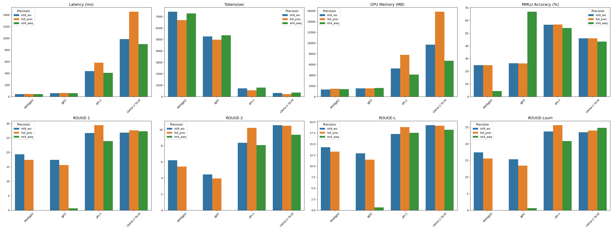

# LLM Inference Optimization and Quantization using TensorRT-LLM

This repository benchmarks multiple Large Language Models in different precision formats using TensorRT-LLM. The workflow includes quantization, engine building, inference benchmarking, accuracy evaluation, and result visualization.

> Note: All experiments were conducted on an **NVIDIA RTX A4000 (Ampere architecture)**. This GPU does **not support FP8** execution, so FP8 benchmarking was excluded from this project.

---

## Project Structure

### Scripts

- `quantize.py`: Converts HuggingFace models into quantized checkpoint format (`int8_wo`, `int4_awq`, `full_prec`).
- `engine.py`: Builds TensorRT-LLM engines from those checkpoints for supported models and precisions.
- `evaluate.py`: Benchmarks each engine (latency, tokens/sec, memory), evaluates MMLU accuracy and ROUGE scores.
- `plot.py`: Generates a single 2×4 grid comparison chart of 8 metrics across all models and precisions.

---

## Models and Formats

### Evaluated Models
- `distilgpt2`
- `gpt2`
- `phi-2`
- `Llama-2-7b`

### Precision Formats
- `int8_wo`: Int8 weight-only quantization
- `int4_awq`: Int4 activation-aware quantization
- `full_prec`: Full precision (fp16)

---

## Metrics Evaluated

- **Latency (ms)**: Average generation time per request
- **Tokens per second**: Throughput efficiency
- **GPU memory (MB)**: Peak memory usage
- **MMLU Accuracy (%)**: Accuracy over a standardized QA benchmark
- **ROUGE-1 / ROUGE-2 / ROUGE-L / ROUGE-Lsum**: Generation quality compared to reference summaries

---

## Visual Summary

The following figure shows side-by-side comparisons of all metrics across models and quantization formats:

Each bar chart represents one metric, comparing the three precisions per model.

---

## Key Observations

- **Latency and tokens/sec** improve significantly with quantization, especially in `int8_wo`.
- **ROUGE scores** remain relatively stable for larger models (phi-2, Llama-2-7b), but degrade for small models under `int4_awq`.
- **distilgpt2** and **gpt2** produced zero or poor ROUGE output under int4 quantization, indicating quantization loss or decoding failures.
- **phi-2** and **Llama-2-7b** are more robust to quantization, especially `int8_wo`.

---

## Conclusion

The results demonstrate that **weight-only INT8 quantization (`int8_wo`) is the most practical and stable format** for accelerating LLM inference on the RTX A4000. It offers **substantial performance gains** (up to 30% faster tokens/sec) while **preserving both accuracy and generation quality**, particularly for medium and large models.

While **INT4-AWQ** can reduce latency and memory further, it is **less reliable** for smaller models such as `distilgpt2` and `gpt2`, which failed to generate valid outputs. However, larger architectures like `phi-2` and `Llama-2-7b-hf` handled INT4 better, albeit with some quality loss.

For deployment on non-FP8 GPUs like Ampere, **full precision (fp16)** remains a strong baseline, but quantization—especially INT8 weight-only—is highly recommended for balancing throughput and model fidelity.

---

## Output Files

- `benchmark_results.csv`: Full metrics table
- `plot.png`: Consolidated visualization